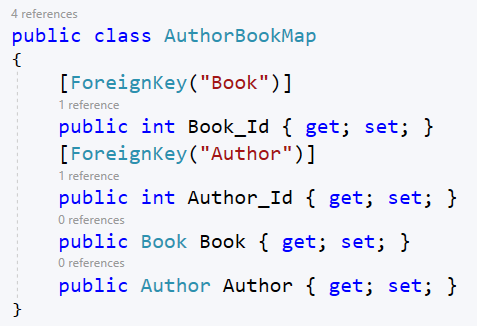
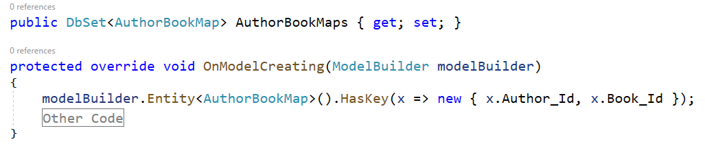

# Learning EF Core

## Nuget Packages

1. Microsoft.EntityFrameworkCore.SqlServer in DataAccess project
2. Microsoft.EntityFrameworkCore.Tools in DataAccess project
3. Microsoft.EntityFrameworkCore.Design in all UI projects

## Migration steps in EF Core

1. Create/Change Model
2. Add migration - ``Add-Migration <Migration_Name>``
3. Remove migration before updating the database - ``Remove-Migration``
4. Apply Migration - ``Update-Database``
5. Rollback to the specific migration - ``Update-Database <Migration_Name>`` 
6. Show all migration name and status - ``Get-Migration``
7. Delete database - ``Drop-Database``

## Data Annotations

- ``[Table("<changed_table_name>")]``
- ``[Column("<changed_column_name>")]``
- ``[Required]``
- ``[Key]``
- ``[MaxLength(<maximum_length_of_a_column>)]``
- ``[NotMapped]``
- ``[ForeignKey(<Foreign_table_property_name>)]``

## Relationships

### One to One

Child Table  (BookDetail)  
.png)  
Parent Table (Book)  
.png)   

### One to Many  

Child Table  (Book)  
.png)  
Parent Table (Publisher)  
.png)   

### Many to Many (Without mapping, .NET 5 to upper version)  

Book (Many to Many with Author)  
%201.PNG)  
Author (Many to Many with Book)  
%201.PNG)  

### Many to Many (With mannual mapping)  

AuthorBookMap class  
  
AuthorBookMap Composit Key  
  
Book (Many to Many with Author)  
%202.PNG)  
Author (Many to Many with Book)  
%202.PNG)  